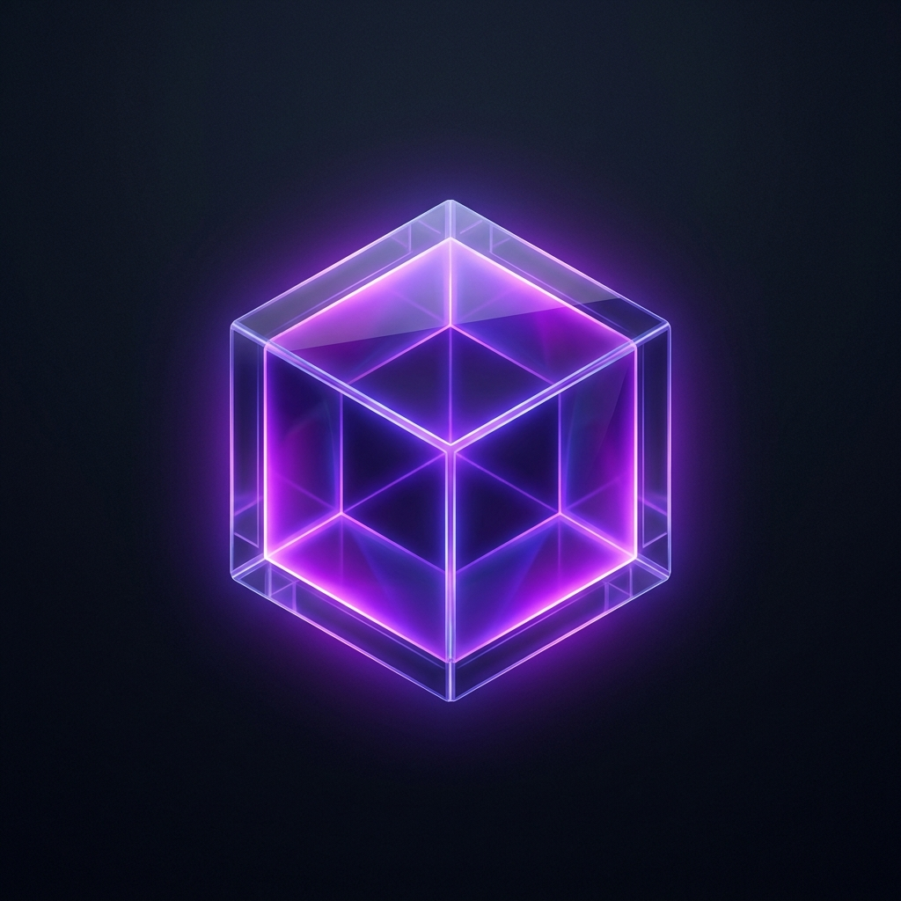

<div align="center">
  
  
  # AuraBox 📦✨
  **The Fully Local, Sandboxed AI Agent**

  [-blue.svg?style=for-the-badge&logo=ollama)](https://ollama.com/)
  [](#)
  [](#)
</div>

<br/>

**AuraBox** is a secure, always-on local AI assistant inspired by high-end enterprise agent architectures (like NVIDIA NemoClaw). It combines a stunning premium web interface with a powerful Node.js backend capable of executing AI-generated JavaScript code in a restricted, sandboxed environment.

Your data never leaves your machine. Your agent runs entirely on your local hardware.

---

## 🌟 Key Features

- **🛡️ 100% Local & Private:** Powered by [Ollama](https://ollama.com/), meaning zero data is sent to the cloud. Perfect for handling sensitive documents or private code.
- **⚡ Agentic Code Execution:** It isn't just a chatbot; it's an Agent. If asked to perform a logic-heavy task, AuraBox will write JavaScript code and securely execute it within a local Node.js `vm` sandbox, analyzing the output autonomously.
- **💎 Premium Aesthetic:** Features a gorgeous Dark Mode UI with glassmorphism effects, dynamic CSS gradients, and smooth auto-scrolling message streams.
- **🪶 Ultra-Lightweight:** Designed to run on *any* machine. Connects to `gemma:2b` for lower-end hardware, but effortlessly scales to `llama3` or `nemotron` when deployed on powerful workstations.

---

## 🏗️ Architecture

AuraBox is split into two cleanly separated layers:

1. **Frontend (`/frontend`)**: A pure Vanilla HTML/CSS/JS client offering a reactive, streaming chat interface. No heavy frameworks—just blazing-fast DOM manipulation.
2. **Backend (`/backend`)**: An Express.js server that acts as a proxy to your local Ollama instance. It intercepts specialized markdown blocks (`javascript execute`) from the AI and executes them in an isolated V8 Virtual Machine context.

---

## 🚀 Quick Start

### Prerequisites
1. **Node.js** (v16 or higher)
2. **Ollama** installed on your system.

### 1. Download Local Model
Make sure you have a model downloaded in Ollama. For most computers, we recommend `gemma:2b` or `llama3`:
```bash
ollama pull gemma:2b
```

### 2. Setup the Project
Clone the repository and install the backend dependencies:
```bash
git clone https://github.com/yourusername/aurabox.git
cd aurabox
npm install
```

### 3. Configure Environment
Check the `backend/.env` file. Ensure it points to your installed model:
```env
OLLAMA_URL=http://localhost:11434
MODEL_NAME=gemma:2b
PORT=5000
```

### 4. Run AuraBox
Start the local server:
```bash
npm start
```
Open your browser and navigate to: **`http://localhost:5000`**

---

## 🛠️ How the Agent Sandbox Works

If you ask AuraBox to "Calculate the first 50 Fibonacci numbers" or "Write a function to reverse a string and test it", the AI will output code wrapped in a specific markdown block:

\`\`\`javascript execute
console.log("Hello from the Sandbox!");
\`\`\`

The frontend detects this, alerts the user, and sends the code to the backend's `/api/execute` endpoint. The Node.js server runs the code in an isolated `vm.Script` context with a 5-second timeout, captures the `console.log` output, and feeds it back into the chat so the AI can read its own execution results.

---

## 🤝 Contributing

Contributions, issues, and feature requests are welcome! Feel free to check the [issues page](#).

## 📄 License

This project is licensed under the MIT License - see the LICENSE file for details.
